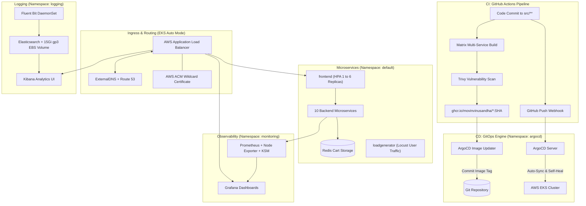

# Production-Grade GitOps-Driven Microservices on AWS EKS

[](https://kubernetes.io/)
[](https://aws.amazon.com/eks/)
[](https://argoproj.github.io/cd/)
[](https://prometheus.io/)
[](https://grafana.com/)
[](https://www.elastic.co/)

A complete, production-grade microservices platform running the **Google Online Boutique** application on **AWS EKS**, managed via **GitOps (ArgoCD + Image Updater)**, automated with **GitHub Actions CI**, monitored with **kube-prometheus-stack**, logged with the **EFK Stack**, and protected with **Horizontal Pod Autoscaling (HPA)**.

Modeled after [`laxmikantagiri/Production-Grade_GitOps-Driven_Microservices-Demo`](https://github.com/laxmikantagiri/Production-Grade_GitOps-Driven_Microservices-Demo) and powered by [MovinVinusandha/google-microservices-demo-infra](https://github.com/MovinVinusandha/google-microservices-demo-infra).

---

## 🌐 Live Services & Endpoints

| Service | URL | Component | Purpose |
| :--- | :--- | :--- | :--- |
| **Online Boutique** | [micro-demo.movinvinusandha.me](https://micro-demo.movinvinusandha.me) | Microservices Storefront | High-traffic e-commerce shopping demo |
| **ArgoCD** | [argocd.micro-demo.movinvinusandha.me](https://argocd.micro-demo.movinvinusandha.me) | GitOps Continuous Delivery | Declarative deployments & self-healing |
| **Grafana** | [grafana.micro-demo.movinvinusandha.me](https://grafana.micro-demo.movinvinusandha.me) | Observability Dashboard | Cluster health, CPU/Memory saturation |
| **Kibana** | [kibana.micro-demo.movinvinusandha.me](https://kibana.micro-demo.movinvinusandha.me) | Centralized Logging | Full-text search over container logs |

---

## 🏛️ System Architecture



---

## 🚀 Key Platform Features

- **Automated CI/CD:** Matrix builds for 11 microservices on GitHub Actions, security scanned with Trivy, pushing immutable commit SHAs to `ghcr.io`.
- **Zero-Touch GitOps:** ArgoCD Image Updater automatically discovers new images in GitHub Container Registry and commits them back to Git; GitHub push webhooks notify ArgoCD for sub-second zero-delay deployments.
- **Dynamic Ingress & DNS:** AWS ALB provisioned automatically by EKS Auto Mode with Route 53 DNS records generated dynamically by ExternalDNS.
- **Production Observability:** Full Prometheus & Grafana stack pre-configured with Kubernetes cluster, node, and pod metrics and operational dashboards.
- **Centralized EFK Logging:** Fluent Bit lightweight DaemonSet streaming parsed JSON container logs to Elasticsearch backed by dynamic AWS EBS storage (`ebs-sc`), queryable in real-time in Kibana.
- **Autoscaling & Resilience:** High-Availability Horizontal Pod Autoscaler (HPA) scaling the frontend between 2 and 6 pods under load, protected by PodDisruptionBudgets (PDB) for `frontend`, `cartservice`, and `grafana` (`minAvailable: 1`).
- **Node Stability & Disruption Controls:** EKS Auto Mode dual NodePool architecture (`general-purpose` and `system`) with Karpenter disruption controls (`karpenter.sh/do-not-disrupt: "true"`) protecting stateful and critical platform workloads (Elasticsearch, Prometheus, Grafana, Kibana) against unexpected node consolidation evictions and ALB 503 flapping.

---

## 📁 Repository Structure

```text
├── .github/workflows/          # CI Pipeline (Matrix build, Trivy scan, GHCR push)
├── argocd/                     # GitOps Application & Image Updater manifests
├── docs/
│   └── deployment-guide.md     # Detailed End-to-End Platform Deployment Guide
├── ingress/                    # AWS ALB Ingress manifests (Store, ArgoCD, Grafana, Kibana)
├── kubernetes-manifests/       # Base Kubernetes deployment & service manifests
├── logging/                    # EFK Stack (Elasticsearch, Fluent Bit, Kibana, StorageClass)
├── observability/              # Observability Stack (kube-prometheus-stack Helm values)
├── scaling/                    # Autoscaling & Resilience (frontend HPA & PDB)
└── src/                        # 11 Microservices application source code
```

---

## 📖 Detailed Documentation

For full step-by-step installation instructions, commands, Helm values, and troubleshooting:
👉 **[Read the Full Deployment Guide (docs/deployment-guide.md)](docs/deployment-guide.md)**
