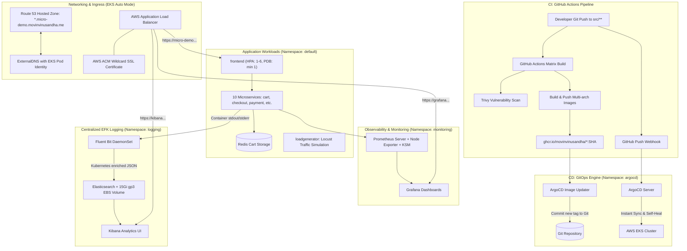

# Production GitOps Microservices on AWS EKS — End-to-End Deployment Guide

This comprehensive guide details the architecture, design decisions, step-by-step setup, troubleshooting, and operations for running the **Google Microservices Demo** on **AWS EKS** using **GitOps (ArgoCD)**, modeled after [`laxmikantagiri/Production-Grade_GitOps-Driven_Microservices-Demo`](https://github.com/laxmikantagiri/Production-Grade_GitOps-Driven_Microservices-Demo).

---

## 1. System Architecture



---

## 2. Live Platform Endpoints

| Component | Endpoint | Authentication | Purpose |
| :--- | :--- | :--- | :--- |
| **Storefront** | `https://micro-demo.movinvinusandha.me` | Public | Customer e-commerce shopping experience |
| **ArgoCD UI** | `https://argocd.micro-demo.movinvinusandha.me` | Admin / SSO | Declarative GitOps deployment dashboard |
| **Grafana** | `https://grafana.micro-demo.movinvinusandha.me` | `admin` / `prom-operator` | Cluster metrics, node saturation, and pod health |
| **Kibana** | `https://kibana.micro-demo.movinvinusandha.me` | Open access | Search and analyze real-time microservices logs |

---

## 3. Step-by-Step Deployment Instructions

### Phase 1: Infrastructure Deployment (Terraform)
1. Navigate to the infrastructure repository `google-microservices-demo-infra`.
2. Deploy VPC, EKS Auto Mode cluster, Route 53 zone, ACM certificate, and Pod Identity:
   ```bash
   terraform init
   terraform apply
   ```
3. Update your domain registrar with the Route 53 nameservers generated by Terraform.

---

### Phase 2: Core Microservices & GitOps Delivery (ArgoCD)

#### 1. Deploy ArgoCD
```bash
helm repo add argo https://argoproj.github.io/argo-helm
helm repo update

helm upgrade --install argo-cd argo/argo-cd \
  --namespace argocd \
  --create-namespace \
  --set server.insecure=true
```

#### 2. Configure Ingress for ArgoCD & Online Boutique
Apply the AWS Application Load Balancer Ingress manifests:
```bash
kubectl apply -f ingress/alb-ingress.yaml
kubectl apply -f ingress/argocd-ingress.yaml
```

#### 3. Deploy ArgoCD Application
Deploy the declarative GitOps application:
```bash
kubectl apply -f argocd/application.yaml
```

#### 4. Configure Automated Image Updates with GHCR & Webhook
1. Create the Docker pull secret using your GitHub Personal Access Token (PAT):
   ```bash
   kubectl create secret docker-registry ghcr-creds \
     --docker-server=ghcr.io \
     --docker-username=MovinVinusandha \
     --docker-password="<YOUR_GITHUB_PAT>" \
     -n argocd
   ```
2. Apply the Image Updater configuration:
   ```bash
   kubectl apply -f argocd/image-updater.yaml
   ```
3. In GitHub (`Settings` -> `Webhooks`):
   - **Payload URL**: `https://argocd.micro-demo.movinvinusandha.me/api/webhook`
   - **Content type**: `application/json`
   - **Events**: `Just the push event`

---

### Phase 3: Observability & Monitoring (`kube-prometheus-stack`)

1. Create the `monitoring` namespace:
   ```bash
   kubectl create ns monitoring
   ```

2. Add the Prometheus Community Helm repository:
   ```bash
   helm repo add prometheus-community https://prometheus-community.github.io/helm-charts
   helm repo update
   ```

3. Deploy Prometheus, Node Exporter, and Grafana:
   ```bash
   helm upgrade --install kube-prometheus-stack prometheus-community/kube-prometheus-stack \
     --namespace monitoring \
     --values observability/prometheus-values.yaml
   ```

4. Expose Grafana via Ingress:
   ```bash
   kubectl apply -f ingress/grafana-ingress.yaml
   ```

---

### Phase 4: Centralized Logging (EFK Stack)

1. Create the `logging` namespace and custom EKS Auto Mode StorageClass:
   ```bash
   kubectl create ns logging
   kubectl apply -f logging/storageclass.yaml
   ```

2. Add Helm repositories:
   ```bash
   helm repo add elastic https://helm.elastic.co
   helm repo add fluent https://fluent.github.io/helm-charts
   helm repo update
   ```

3. Deploy Elasticsearch (Single Node with `15Gi gp3` persistent storage):
   ```bash
   helm upgrade --install elasticsearch elastic/elasticsearch \
     --version 7.17.3 \
     --namespace logging \
     --values logging/elasticsearch-values.yaml
   ```

4. Deploy Fluent Bit DaemonSet:
   ```bash
   helm upgrade --install fluent-bit fluent/fluent-bit \
     --namespace logging \
     --values logging/fluent-bit-values.yaml
   ```

5. Deploy Kibana and expose via Ingress:
   ```bash
   helm upgrade --install kibana elastic/kibana \
     --version 7.17.3 \
     --namespace logging \
     --values logging/kibana-values.yaml

   kubectl apply -f ingress/kibana-ingress.yaml
   ```

6. In the Kibana web console:
   - Go to **Management** -> **Index Patterns** (or Data Views).
   - Create pattern `fluent-bit*` with time field `@timestamp`.
   - Open **Discover** to search container logs.

---

### Phase 5: Scaling & Reliability (HPA, PDB & NodePools)

1. Install the Kubernetes Metrics Server:
   ```bash
   kubectl apply -f https://github.com/kubernetes-sigs/metrics-server/releases/latest/download/components.yaml
   ```

2. Apply High-Availability HPA (Min 2 Replicas) & Pod Disruption Budgets (PDB):
   ```bash
   kubectl apply -f scaling/frontend-hpa.yaml
   kubectl apply -f scaling/frontend-pdb.yaml
   kubectl apply -f scaling/cartservice-pdb.yaml
   ```

3. High-Availability Multi-Replica & Node Stability Architecture:
   - **`frontend`**: Scaled with `minReplicas: 2` (max 6) and guarded by `frontend-pdb` (`minAvailable: 1`).
   - **`cartservice`**: Guarded by `cartservice-pdb` (`minAvailable: 1`).
   - **`grafana`**: Deployed with `replicas: 2` and a built-in PodDisruptionBudget (`minAvailable: 1`).
   - **EKS Auto Mode NodePools**: `general-purpose` handles user microservices with on-demand/spot scaling, while the dedicated `system` NodePool handles core Kubernetes system infrastructure (`CriticalAddonsOnly`). Platform pods (Prometheus, Elasticsearch, Kibana) utilize `karpenter.sh/do-not-disrupt: "true"` to guarantee zero node churn.

4. Test Autoscaling under Load:
   ```bash
   # Scale up load generator to 150 concurrent shoppers
   kubectl set env deployment/loadgenerator USERS=150 RATE=10 -n default

   # Watch frontend replicas scale up from 2 to 6
   kubectl get hpa frontend-hpa -w

   # Reset back to baseline
   kubectl set env deployment/loadgenerator USERS=10 RATE=1 -n default
   ```

---

## 4. Key Pitfalls & Root Cause Resolutions

| Challenge Encountered | Root Cause | Engineering Solution |
| :--- | :--- | :--- |
| **EBS Volume Pending** | Legacy `gp2` StorageClass used deprecated in-tree provisioner incompatible with EKS Auto Mode. | Created `ebs-sc` StorageClass using `ebs.csi.eks.amazonaws.com` provisioner and installed EBS CSI driver via Terraform. |
| **Elasticsearch Unready (0/1)** | Single-node Elasticsearch clusters can never achieve `green` health because replica shards cannot be assigned. | Configured readiness check parameter: `wait_for_status=yellow&timeout=15s`. |
| **Elasticsearch Startup Crash** | `index.number_of_replicas: 0` was set in `elasticsearch.yml`, which is forbidden in ES 7.x/8.x. | Removed index-level property from node configuration file. |
| **Fluent Bit CrashLoopBackOff** | Fluent Bit Helm chart liveness probe checked port 2020, but the internal HTTP server was off by default. | Enabled `HTTP_Server On`, `HTTP_Port 2020` in Fluent Bit service configuration. |
| **Kibana Probe Timeouts (503)** | Heavy `/app/kibana` UI probe timed out due to OpenTelemetry instrumentation latency. | Updated probe to use lightweight `/api/status` endpoint with 10s timeout and 60s initial delay. |
| **Image Updater Secret Error** | Custom `secret:argocd/git-creds#username:password` string format failed internal regex parsing. | Created standard `kubernetes.io/dockerconfigjson` secret and referenced via `pullsecret:argocd/ghcr-creds`. |
| **Intermittent 503 / Pod Evictions** | EKS Auto Mode / Karpenter node consolidation aggressively evicted single-replica pods (`Underutilized`). | Added `karpenter.sh/do-not-disrupt: "true"` annotation to prevent consolidation evictions for critical pods. |
